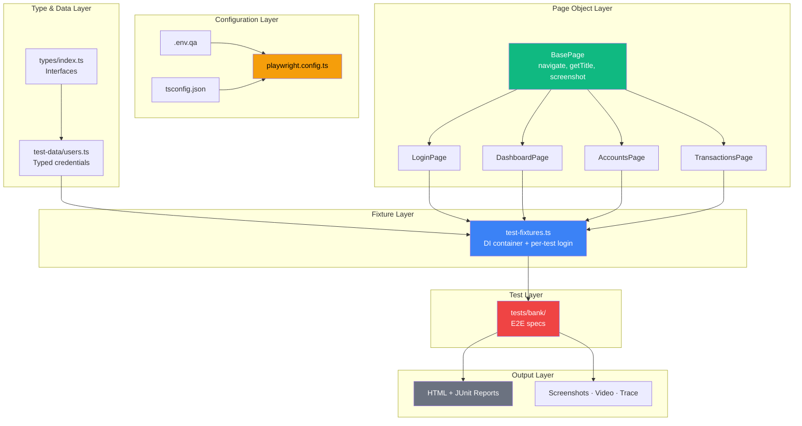

# SecureBank Test Automation Framework

[](https://playwright.dev/)
[](https://www.typescriptlang.org/)
[](https://nodejs.org/)
[](https://eslint.org/)
[](https://github.com/features/actions)

End-to-end test automation framework for the [SecureBank](https://qaplayground.com/bank) demo application, built with Playwright and TypeScript. It uses a layered architecture with the Page Object Model, fixture-based dependency injection, and multi-environment configuration via `.env` files.

> **Status: in active development.** The architecture, tooling, and CI are in place. Test coverage and several features are still being built out — see the [Roadmap](#roadmap) for what's done and what's planned. This README documents only what exists today.

---

## Current State at a Glance

| Area              | Status                                                          |
| ----------------- | --------------------------------------------------------------- |
| Page Objects      | ✅ 4 (Login, Dashboard, Accounts, Transactions)                 |
| Custom Fixtures   | ✅ 7 (incl. `page` override + auto-screenshot on failure)       |
| Test Specs        | 🟡 `tests/bank/` only (login + fixture demos)                   |
| Browsers          | ✅ Chromium, Firefox, Mobile Chrome (Pixel 7) configured        |
| Authentication    | ✅ Per-test login via `loggedInPage` fixture                    |
| CI/CD             | ✅ GitHub Actions + Jenkins pipeline                            |
| Code Quality      | ✅ TypeScript strict, ESLint, Prettier, Husky, lint-staged      |

Legend: ✅ done · 🟡 partial / in progress

---

## Table of Contents

- [Architecture](#architecture)
- [Folder Structure](#folder-structure)
- [Prerequisites](#prerequisites)
- [Setup](#setup)
- [Running Tests](#running-tests)
- [Page Object Pattern](#page-object-pattern)
- [Fixtures](#fixtures)
- [Authentication](#authentication)
- [Environment Configuration](#environment-configuration)
- [Reporting](#reporting)
- [Code Quality](#code-quality)
- [CI/CD](#cicd)
- [Roadmap](#roadmap)
- [Troubleshooting](#troubleshooting)
- [Contributing](#contributing)

---

## Architecture

The framework is organized into layers with single responsibilities; dependencies flow downward.



### Design Principles

| Principle                 | Where Applied                                                              |
| ------------------------- | -------------------------------------------------------------------------- |
| **Single Responsibility** | Each page class handles one page; each fixture provides one concern        |
| **DRY**                   | Common utilities live in `BasePage`; all pages inherit them                |
| **Dependency Injection**  | Fixtures inject ready-to-use page objects into tests                       |
| **Inversion of Control**  | Playwright controls the object lifecycle, not the test                     |
| **Facade**                | Multi-step actions (e.g., `addAccount`) are exposed as a single method     |

---

## Folder Structure

```
playwright-framework/
├── .github/
│   └── workflows/
│       └── playwright.yml          # GitHub Actions workflow
├── .husky/
│   └── pre-commit                  # Runs lint-staged before commit
├── fixtures/
│   └── test-fixtures.ts            # Custom fixtures (DI container)
├── pages/
│   ├── BasePage.ts                 # Shared page, common methods
│   └── qaplayground/
│       ├── LoginPage.ts            # Bank login interactions
│       ├── DashboardPage.ts        # Dashboard + add account
│       ├── AccountsPage.ts         # Search, filter, sort accounts
│       ├── TransactionsPage.ts     # Filter transactions by date/type
│       └── index.ts                # Barrel re-export
├── test-data/
│   └── users.ts                    # Typed credentials (from env)
├── tests/
│   └── bank/                       # SecureBank specs (login, fixtures)
├── types/
│   └── index.ts                    # Shared TypeScript interfaces
├── .env.qa                         # QA environment variables (gitignored)
├── .gitignore
├── .prettierrc                     # Prettier formatting rules
├── .prettierignore
├── eslint.config.mjs               # ESLint flat config
├── Jenkinsfile                     # Jenkins declarative pipeline
├── tsconfig.json                   # TypeScript compiler options
├── package.json
└── playwright.config.ts            # Playwright configuration
```

> Empty `tests/api/`, `tests/advanced/`, and `tests/practice/` directories are scaffolding for planned suites (see [Roadmap](#roadmap)).

---

## Prerequisites

- Node.js 20 or later
- npm 9 or later
- Git

---

## Setup

```bash
# Clone the repository
git clone <repo-url>
cd playwright-framework

# Install dependencies
npm ci

# Install Playwright browsers
npx playwright install --with-deps

# Create the environment file (see Environment Configuration for variables)
touch .env.qa
# Add QA_PLAYGROUND_URL, BANK_USERNAME, BANK_PASSWORD, etc.
```

---

## Running Tests

```bash
# Run all tests
npm run test

# Run with browser visible
npm run test:headed

# Run on Chromium only
npm run test:chrome

# Run with Playwright Inspector (step-through debugger)
npm run test:debug

# Run a specific test file
npx playwright test tests/bank/login.spec.ts

# Run tests by tag
npx playwright test --grep @smoke

# View the HTML report
npm run report
```

### Available npm Scripts

| Script         | Command                                  | Purpose                   |
| -------------- | ---------------------------------------- | ------------------------- |
| `test`         | `npx playwright test`                    | Run all tests (headless)  |
| `test:headed`  | `npx playwright test --headed`           | Run with browser visible  |
| `test:chrome`  | `npx playwright test --project=chromium` | Chromium only             |
| `test:debug`   | `npx playwright test --debug`            | Open Playwright Inspector |
| `report`       | `npx playwright show-report`             | View HTML report          |
| `lint`         | `eslint .`                               | Check code quality        |
| `lint:fix`     | `eslint . --fix`                         | Auto-fix lint issues      |
| `format`       | `prettier --write .`                     | Format all files          |
| `format:check` | `prettier --check .`                     | Verify formatting         |

---

## Page Object Pattern

Every page class extends `BasePage`. Locators are declared as `readonly Locator` properties initialized in the constructor; actions are public async methods.

```typescript
export class LoginPage extends BasePage {
    readonly usernameField: Locator;
    readonly passwordField: Locator;
    readonly loginButton: Locator;

    constructor(page: Page) {
        super(page);
        this.usernameField = page.getByTestId('username-input');
        this.passwordField = page.getByTestId('password-input');
        this.loginButton = page.getByTestId('login-button');
    }

    async login(credentials: BankCredentials): Promise<void> {
        await this.usernameField.fill(credentials.username);
        await this.passwordField.fill(credentials.password);
        await this.loginButton.click();
    }
}
```

### Conventions

1. Locators are declared once as `readonly Locator` properties in the constructor.
2. Actions are public async methods with explicit return types.
3. Page classes contain **no assertions** — assertions belong in spec files.
4. Multi-step workflows are wrapped in a single **facade method** (e.g., `addAccount`).

### Locator Priority

Prefer the most resilient option:

1. `getByTestId()` — contract between dev and QA, survives refactors
2. `getByRole()` — accessibility-based, survives visual redesigns
3. `getByLabel()` — form fields by visible label
4. `getByText()` — visible text lookup
5. CSS / XPath — last resort, most fragile

---

## Fixtures

The framework uses Playwright's fixture system for dependency injection. Tests request only the fixtures they need.

| Fixture            | Purpose                                        | Auto? |
| ------------------ | ---------------------------------------------- | ----- |
| `page` (override)  | Adds a global popup handler to every page      | —     |
| `loginPage`        | LoginPage navigated to `/bank`                 | No    |
| `dashboardPage`    | DashboardPage instance                         | No    |
| `accountsPage`     | AccountsPage instance                          | No    |
| `transactionsPage` | TransactionsPage instance                      | No    |
| `loggedInPage`     | Logs in, then bundles the authenticated pages  | No    |
| `autoScreenshot`   | Full-page screenshot on test failure           | Yes   |

### Usage

```typescript
// Test the login flow itself
test('invalid credentials show error', async ({ loginPage }) => {
    await loginPage.login(BANK_INVALID_USER);
    expect(await loginPage.isErrorVisible()).toBeTruthy();
});

// Test that needs an authenticated session
test('dashboard is reachable after login', async ({ loggedInPage }) => {
    const { dashboardPage } = loggedInPage;
    const heading = await dashboardPage.getDashboardHeading();
    expect(heading).toContain('Quick Actions');
});
```

---

## Authentication

Tests that need an authenticated session use the `loggedInPage` fixture, which performs an **explicit login per test**.

> **Why not `storageState` ("login once")?** SecureBank stores its auth token (`currentUser`) in **sessionStorage**. Playwright's `storageState` persists only **cookies + localStorage — never sessionStorage** — so a saved state can't re-authenticate. Per-test login is the reliable approach here. Optimizing to login-once by capturing/restoring sessionStorage via `page.addInitScript` is a deliberate [Roadmap](#roadmap) item for when the suite is large enough that login time matters.

---

## Environment Configuration

Environment values live in `.env` files, loaded via `dotenv` at config time.

| Variable             | Description                     |
| -------------------- | ------------------------------- |
| `QA_PLAYGROUND_URL`  | Base URL for the SecureBank app |
| `BANK_USERNAME`      | Login username                  |
| `BANK_PASSWORD`      | Login password                  |
| `API_BASE_URL`       | REST API base URL (planned)     |

### Switching Environments

```bash
# QA (default)
npx playwright test

# Staging (requires .env.staging)
ENV=staging npx playwright test
```

`playwright.config.ts` reads `ENV` and loads the matching `.env.<env>` file.

> **Security:** `.env` files are gitignored and must never be committed. Each developer creates their own.

---

## Reporting

| Output     | Location / Setting              | Notes                            |
| ---------- | ------------------------------- | -------------------------------- |
| HTML       | `playwright-report/`            | `npx playwright show-report`     |
| JUnit XML  | `results/junit-results.xml`     | Parsed by CI natively            |
| Screenshot | `screenshot: 'only-on-failure'` | Visual state at failure          |
| Video      | `video: 'retain-on-failure'`    | Full test replay                 |
| Trace      | `trace: 'retain-on-failure'`    | DOM + network + console timeline |

Open a trace for step-by-step debugging:

```bash
npx playwright show-trace test-results/<test-name>/trace.zip
```

---

## Code Quality

- **ESLint** (`@typescript-eslint`, flat config) — includes `no-floating-promises` to catch missing `await`, the most common source of flaky Playwright tests.
- **Prettier** — single quotes, 4-space indent, trailing commas, semicolons.
- **Husky + lint-staged** — a `pre-commit` hook runs `eslint --fix` and `prettier --write` on staged `*.ts` files.

```bash
npm run lint          # Check
npm run lint:fix      # Auto-fix
npm run format        # Format all files
npm run format:check  # Verify formatting (CI-safe)
```

---

## CI/CD

### GitHub Actions

`.github/workflows/playwright.yml` runs on push and PR to `main`/`master`, and on manual dispatch:

`checkout → setup Node 20 → npm ci → install browsers → ESLint → run tests → upload report + artifacts`

Secrets (`QA_PLAYGROUND_URL`, `BANK_USERNAME`, `BANK_PASSWORD`, `API_BASE_URL`) are injected from GitHub repository secrets into `.env.qa` at runtime.

### Jenkins

A declarative `Jenkinsfile` is provided at the project root with parameterized browser/environment selection.

---

## Roadmap

What's planned, roughly in priority order. Items move into the sections above as they ship.

### Test Coverage
- [ ] Add asserting specs for Accounts (search, filter, sort) under `tests/bank/`
- [ ] Add asserting specs for Transactions (filter by account/type/date)
- [ ] Add end-to-end user-journey specs (login → add account → transact → verify)
- [ ] Replace the remaining `console.log`-only checks in `login.spec.ts` with real `expect` assertions
- [ ] Build out `tests/practice/` (forms, alerts, tables)
- [ ] Build out `tests/advanced/` (iframe, shadow DOM)
- [ ] Build out `tests/api/` (REST specs using Playwright's `request` fixture)

### Authentication
- [ ] Optimize to login-once: capture sessionStorage (`currentUser`) in a setup project and re-inject it via `page.addInitScript`, then switch `loggedInPage` off per-test login. Only worthwhile once login time dominates the suite runtime.

### Tooling & Infrastructure
- [ ] Add a `Dockerfile` based on the official Playwright image
- [ ] Add a `.env.example` template for onboarding
- [ ] Add a `helpers/` layer (logger, safe-action wrappers) if shared utilities emerge
- [ ] Enable Firefox and Mobile Chrome in CI once the suite is stable
- [ ] Apply `@smoke` / `@regression` tags consistently across all specs

### Housekeeping
- [x] Rename `jenkinsFile` → `Jenkinsfile` (Jenkins requires the exact casing)
- [x] Reconcile the `BankTransaction` type with the app's actual transaction shape

---

## Troubleshooting

### Tests time out locally
Check network connectivity, or raise the timeout: `npx playwright test --timeout=60000`.

### Auth / session issues
Login happens per-test via the `loggedInPage` fixture. If auth fails, confirm
`BANK_USERNAME` / `BANK_PASSWORD` in `.env.qa` are correct and that the login
form locators still match the app.

### Locator not found
1. Open the Inspector: `npx playwright test --debug`
2. Generate locators with Codegen: `npx playwright codegen https://qaplayground.com/bank`
3. Confirm the element isn't inside an iframe or shadow DOM, and isn't covered by an overlay

### CI passes but local fails (or vice versa)
- Confirm `.env.qa` values match CI secrets
- CI runs headless and on Linux — compare with `npx playwright test --headed`
- Ensure no test depends on local clock or timezone

---

## Contributing

1. Branch from `main`
2. Follow the page object and fixture patterns above
3. **Every test must assert** — no `console.log`-only checks
4. Tag new tests with `@smoke` or `@regression` as appropriate
5. Run locally before pushing: `npm run lint && npm run test`
6. Open a PR and verify CI before requesting review
