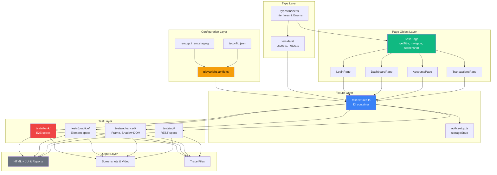
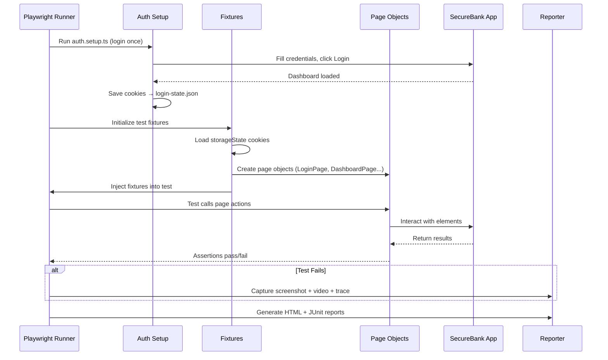
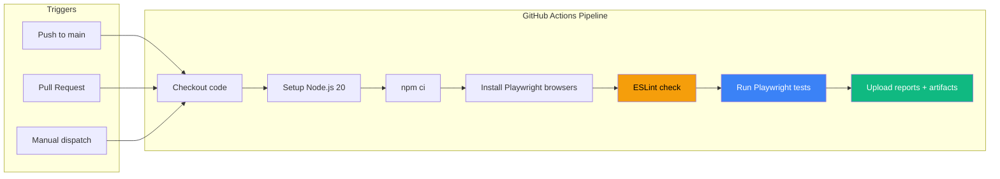

# SecureBank Test Automation Framework

[](https://playwright.dev/)
[](https://www.typescriptlang.org/)
[](https://nodejs.org/)
[](https://eslint.org/)
[](https://github.com/features/actions)

End-to-end test automation framework for the [SecureBank](https://qaplayground.com/bank) application, built with Playwright and TypeScript. Follows a layered architecture with the Page Object Model, fixture-based dependency injection, persistent auth via `storageState`, and multi-environment support through `.env` configuration.

---

## Quick Stats

| Metric | Value |
|--------|-------|
| Page Objects | 4 (Login, Dashboard, Accounts, Transactions) |
| Custom Fixtures | 6 (incl. auto-screenshot on failure) |
| Browsers | Chromium (Firefox, WebKit ready to enable) |
| Auth Strategy | storageState (login once, reuse everywhere) |
| CI/CD | GitHub Actions + Jenkins |
| Containerization | Docker (Playwright official image) |

---

## Table of Contents

- [Architecture](#architecture)
- [Test Execution Flow](#test-execution-flow)
- [CI/CD Pipeline](#cicd-pipeline)
- [Folder Structure](#folder-structure)
- [Prerequisites](#prerequisites)
- [Setup](#setup)
- [Running Tests](#running-tests)
- [Test Organization](#test-organization)
- [Page Object Guidelines](#page-object-guidelines)
- [Fixtures](#fixtures)
- [Environment Configuration](#environment-configuration)
- [Reporting](#reporting)
- [Code Quality](#code-quality)
- [Docker](#docker)
- [Troubleshooting](#troubleshooting)
- [Contributing](#contributing)

---

## Architecture

The framework is organized into six layers. Each layer has a single responsibility, and dependencies flow strictly downward.



### Design Principles

| Principle | Where Applied |
|-----------|---------------|
| **Single Responsibility** | Each page class handles one page; each fixture provides one concern |
| **Encapsulation** | Locators are `private`; tests interact through public action methods |
| **DRY** | Common utilities live in `BasePage`; all pages inherit them |
| **Dependency Injection** | Fixtures inject ready-to-use page objects into tests |
| **Inversion of Control** | Playwright controls object creation lifecycle, not the test |
| **Facade** | Complex multi-step actions (e.g., `addAccount`) exposed as a single method |

---

## Test Execution Flow



---

## CI/CD Pipeline



Jenkins pipeline is also available via the `Jenkinsfile` at the project root, with parameterized browser and environment selection.

---

## Folder Structure

```
playwright-framework/
├── .github/
│   └── workflows/
│       └── playwright.yml          # GitHub Actions workflow
├── auth/
│   └── auth.setup.ts               # Login once, save storageState
├── fixtures/
│   └── test-fixtures.ts            # Custom fixtures (DI container)
├── helpers/                        # Logger, SafeActions, utilities
├── pages/
│   ├── BasePage.ts                 # Protected page, common methods
│   └── qaplayground/
│       ├── LoginPage.ts            # Bank login interactions
│       ├── DashboardPage.ts        # Dashboard + add account
│       ├── AccountsPage.ts         # Search, filter, sort accounts
│       ├── TransactionsPage.ts     # Filter transactions by date/type
│       └── index.ts                # Barrel re-export
├── screenshots/                    # Auto-captured on failure
├── test-data/
│   └── users.ts                    # Typed credentials
├── tests/
│   ├── bank/                       # SecureBank E2E specs
│   ├── practice/                   # Element interaction specs
│   ├── advanced/                   # iFrame, Shadow DOM specs
│   └── api/                        # REST API specs
├── types/
│   └── index.ts                    # Shared TypeScript interfaces
├── .env.qa                         # QA environment variables
├── .gitignore
├── Dockerfile                      # Containerized test execution
├── Jenkinsfile                     # Jenkins declarative pipeline
├── eslint.config.mjs               # ESLint flat config
├── .prettierrc                     # Prettier formatting rules
├── tsconfig.json                   # TypeScript compiler options
├── package.json
└── playwright.config.ts            # Playwright configuration
```

---

## Prerequisites

- Node.js 20 or later
- npm 9 or later
- Git

---

## Setup

```bash
# Clone the repository
git clone <repo-url>
cd playwright-framework

# Install dependencies
npm ci

# Install Playwright browsers
npx playwright install --with-deps

# Create environment file
cp .env.example .env.qa
# Edit .env.qa with your credentials
```

---

## Running Tests

```bash
# Run all tests
npm run test

# Run with browser visible
npm run test:headed

# Run on Chromium only
npm run test:chrome

# Run with Playwright Inspector (step-through debugger)
npm run test:debug

# Run a specific test file
npx playwright test tests/bank/login.spec.ts

# Run tests by tag
npx playwright test --grep @smoke
npx playwright test --grep @regression

# Exclude tests by tag
npx playwright test --grep-invert @slow

# View the HTML report
npm run report
```

### Available npm Scripts

| Script | Command | Purpose |
|--------|---------|---------|
| `test` | `npx playwright test` | Run all tests (headless) |
| `test:headed` | `npx playwright test --headed` | Run with browser visible |
| `test:chrome` | `npx playwright test --project=chromium` | Chromium only |
| `test:debug` | `npx playwright test --debug` | Open Playwright Inspector |
| `report` | `npx playwright show-report` | View HTML report |
| `lint` | `eslint .` | Check code quality |
| `lint:fix` | `eslint . --fix` | Auto-fix lint issues |
| `format` | `prettier --write .` | Format all files |
| `format:check` | `prettier --check .` | Verify formatting |

---

## Test Organization

Tests are grouped by application area and tagged for selective execution.

```
tests/
├── bank/                     # SecureBank application
│   ├── login.spec.ts         # Login and authentication flows
│   ├── accounts.spec.ts      # Account management (CRUD, filter, sort)
│   ├── transactions.spec.ts  # Transaction filtering and history
│   └── e2e-flow.spec.ts      # End-to-end user journeys
├── practice/                 # QA Playground practice elements
│   ├── forms.spec.ts         # Input fields, dropdowns, checkboxes
│   ├── alerts.spec.ts        # Alert, confirm, prompt dialogs
│   └── tables.spec.ts        # Data tables, sorting, pagination
├── advanced/                 # Complex UI patterns
│   ├── iframe.spec.ts        # iFrame interactions
│   └── shadow-dom.spec.ts    # Shadow DOM element handling
└── api/                      # REST API testing
    └── notes.api.spec.ts     # CRUD operations on Notes API
```

### Tagging Convention

| Tag | Purpose | When to Run |
|-----|---------|-------------|
| `@smoke` | Critical path coverage | Every PR, every deploy |
| `@regression` | Full feature coverage | Nightly, pre-release |
| `@e2e` | Multi-page user flows | Nightly |

```typescript
test('valid login redirects to dashboard @smoke', async ({ loginPage }) => {
    // ...
});
```

---

## Page Object Guidelines

Every page class extends `BasePage` and follows these conventions.

### Structure

```typescript
export class LoginPage extends BasePage {
    constructor(page: Page) {
        super(page);
    }

    // Private locators — encapsulated, tests never access these
    private usernameField() {
        return this.page.getByTestId('username-input');
    }

    // Public actions — the only interface tests interact with
    async login(credentials: BankCredentials): Promise<void> {
        await this.usernameField().fill(credentials.username);
        await this.passwordField().fill(credentials.password);
        await this.loginButton().click();
    }
}
```

### Rules

1. Locators are always **private methods** (lazy evaluation, no stale references)
2. Actions are always **public async methods** with explicit return types
3. Page classes contain **no assertions** — assertions belong in spec files
4. Complex multi-step workflows are wrapped in a single **facade method**
5. Navigation to the page is handled by the **fixture or a dedicated `goTo()` method**, not by the test

### Locator Priority

When choosing a locator strategy, prefer the most resilient option:

1. `getByTestId()` — contract between dev and QA, survives refactors
2. `getByRole()` — accessibility-based, survives visual redesigns
3. `getByLabel()` — form fields by visible label text
4. `getByText()` — general visible text lookup
5. `getByPlaceholder()` — input placeholder text
6. CSS / XPath — last resort, most fragile

---

## Fixtures

The framework uses Playwright's fixture system for dependency injection. Tests request only the fixtures they need; unused fixtures are never instantiated.

| Fixture | Purpose | Auto? |
|---------|---------|-------|
| `page` (override) | Adds global popup handler to every page | — |
| `loginPage` | LoginPage navigated to `/bank` | No |
| `dashboardPage` | DashboardPage instance | No |
| `accountsPage` | AccountsPage instance | No |
| `transactionsPage` | TransactionsPage instance | No |
| `loggedInPage` | All pages bundled, already authenticated | No |
| `autoScreenshot` | Captures full-page screenshot on test failure | Yes |

### Usage

```typescript
// Test that needs login page (tests login flow itself)
test('invalid credentials show error', async ({ loginPage }) => {
    await loginPage.login(BANK_INVALID_USER);
    expect(await loginPage.isErrorVisible()).toBeTruthy();
});

// Test that needs authenticated session (most tests)
test('dashboard shows account balance', async ({ loggedInPage }) => {
    const { dashboardPage } = loggedInPage;
    const heading = await dashboardPage.getDashboardHeading();
    expect(heading).toContain('SecureBank');
});
```

---

## Environment Configuration

Environment-specific values are stored in `.env` files and loaded via `dotenv` at config time.

| Variable | Description |
|----------|-------------|
| `QA_PLAYGROUND_URL` | Base URL for the SecureBank app |
| `EXPAND_TESTING_URL` | Base URL for practice site |
| `BANK_USERNAME` | Login username |
| `BANK_PASSWORD` | Login password |
| `API_BASE_URL` | REST API base URL |

### Switching Environments

```bash
# QA (default)
npx playwright test

# Staging
ENV=staging npx playwright test
```

The `playwright.config.ts` reads `ENV` and loads the corresponding `.env.<env>` file automatically.

> **Security note:** `.env` files are listed in `.gitignore` and must never be committed. Each developer creates their own from `.env.example`.

---

## Reporting

### HTML Report (default)

Generated after every run in `playwright-report/`. Includes screenshots, video recordings, and trace files for failed tests.

```bash
npx playwright show-report
```

### JUnit XML

Written to `results/junit-results.xml` for CI/CD integration. Jenkins and GitHub Actions both parse this format natively.

### Artifacts Captured on Failure

| Artifact | Config Setting | Purpose |
|----------|----------------|---------|
| Screenshot | `screenshot: 'only-on-failure'` | Visual state at failure |
| Video | `video: 'retain-on-failure'` | Full test replay |
| Trace | `trace: 'retain-on-failure'` | DOM + network + console timeline |

Open a trace file for step-by-step debugging:

```bash
npx playwright show-trace test-results/<test-name>/trace.zip
```

---

## Code Quality

### ESLint

Configured with `@typescript-eslint` and the `no-floating-promises` rule, which catches missing `await` statements at lint time — the single most common source of flaky Playwright tests.

```bash
npm run lint        # Check for issues
npm run lint:fix    # Auto-fix where possible
```

### Prettier

Enforces consistent formatting (single quotes, 4-space indent, trailing commas, semicolons).

```bash
npm run format        # Format all files
npm run format:check  # Verify formatting (CI-safe)
```

---

## Docker

The `Dockerfile` uses Playwright's official image with all browsers pre-installed.

```bash
# Build the image
docker build -t playwright-tests .

# Run all tests
docker run playwright-tests

# Run with a specific tag
docker run playwright-tests npx playwright test --grep @smoke
```

---

## Troubleshooting

### Tests timeout locally

Increase the default timeout or check network connectivity:

```bash
npx playwright test --timeout=60000
```

### Auth state expired

Delete the cached state and re-run setup:

```bash
rm auth/login-state.json
npx playwright test --project=setup
```

### Locator not found

1. Open the Playwright Inspector to interact with the page: `npx playwright test --debug`
2. Use Codegen to generate locators: `npx playwright codegen https://qaplayground.com/bank`
3. Check if the element is inside an iframe or shadow DOM
4. Verify the element is visible and not obscured by an overlay

### CI passes but local fails (or vice versa)

- Confirm `.env.qa` values match CI secrets
- CI runs headless; try `npx playwright test --headed` locally to compare
- CI runs on Linux; check for OS-specific rendering differences
- Ensure no test depends on local clock or timezone

---

## Contributing

1. Branch from `main`
2. Follow the page object and fixture patterns described above
3. Tag new tests with `@smoke` or `@regression` as appropriate
4. Run the full suite locally: `npm run test`
5. Run lint: `npm run lint`
6. Push, open a PR, and verify CI results before requesting review